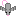

# Vampirat

## About

Vampirat is an entry into the [Minijam Game Jam 118 - Vampire](https://itch.io/jam/mini-jam-118-vampires/).  
I had a bunch of rat drawings from 37 rats memes so I decided to put them to use in my first game jam.  
Made with Construct 3 as that was what we have to learn for school.  

## Plan

- Rat could be a standard rat bitten by bat to become vampire
- Protect friend rats from things destroyed by blood
- ~~Jelly blobs as enemies maybe? (too much liquid makes them unstable and pop?)~~ DONE  
  
  - ~~End of game creates a wave of water to dissolve them?~~ DONE
- ~~Switch from rat to rat-bat~~ DONE  
    
